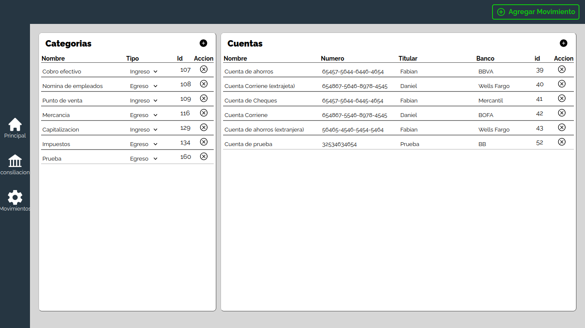

# [Liberty Bank](https://github.com/famerca/liberty-bank "liberty") 

Bank account management application, where a company or individual can manage their accounts, whether personal or business, you can add as many accounts as you want, you can view total balances of the company, or specific accounts, you can see income as well As expenses, you can filter them by date, category, accounts, as well as customize categories, where you can identify your company's transactions in the way you want.

This application was developed as a team, for the software engineering subject at the university, it was delivered as a final project, it was also developed applying the scrum methodology, and due to lack of time we needed to put unit tests, and better refactor the code, but It is functional and you can test it locally through:

```
npm run server
```

photos of this application:

1. 
2. 
3. 
4. 


